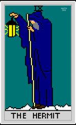
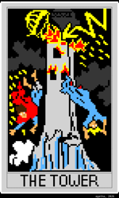
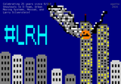

# ascii art
_repository of ascii art_

## gallery

<!-- GALLERY:START -->

### agatha

<table>
<tr>
<td align="center"><a href=".img/agatha/hello.png"></a><br><a href="https://raw.githubusercontent.com/agathanon/ascii/HEAD/agatha/hello.txt">hello.txt</a></td>
<td align="center"><a href=".img/agatha/tarot-hermit.png"></a><br><a href="https://raw.githubusercontent.com/agathanon/ascii/HEAD/agatha/tarot-hermit.txt">tarot-hermit.txt</a></td>
<td align="center"><a href=".img/agatha/tarot-nineswords.png"></a><br><a href="https://raw.githubusercontent.com/agathanon/ascii/HEAD/agatha/tarot-nineswords.txt">tarot-nineswords.txt</a></td>
</tr>
<tr>
<td align="center"><a href=".img/agatha/tarot-tower.png"></a><br><a href="https://raw.githubusercontent.com/agathanon/ascii/HEAD/agatha/tarot-tower.txt">tarot-tower.txt</a></td>
<td align="center"><a href=".img/agatha/wtc25.png"></a><br><a href="https://raw.githubusercontent.com/agathanon/ascii/HEAD/agatha/wtc25.txt">wtc25.txt</a></td>
<td align="center"><a href=".img/agatha/zyn-v2.png"></a><br><a href="https://raw.githubusercontent.com/agathanon/ascii/HEAD/agatha/zyn-v2.txt">zyn-v2.txt</a></td>
</tr>
<tr>
<td align="center"><a href=".img/agatha/zyn.png"></a><br><a href="https://raw.githubusercontent.com/agathanon/ascii/HEAD/agatha/zyn.txt">zyn.txt</a></td>
</tr>
</table>

### psyk0

<table>
<tr>
<td align="center"><a href=".img/psyk0/pissflection.png"></a><br><a href="https://raw.githubusercontent.com/agathanon/ascii/HEAD/psyk0/pissflection.txt">pissflection.txt</a></td>
</tr>
</table>

<!-- GALLERY:END -->

## how to pump
**pumping with weechat**:
```
/set irc.server.efnet.anti_flood_prio_low 0
/set irc.server.efnet.anti_flood_prio_high 0

/alias pump /exec -o -sh while IFS= read -r l\; do printf "%s\n" "$l"\; sleep 0.3\; done < $1

/pump ~/art/tarot-tower.txt
```

**pumping on android with HexDroid**:

currently i see no local file system reads from hexdroid scripts, only http, so for now you're
limited to pumping from http sources, but you can use the following `.hex` script:
```
; pump.hex - /pump <url> pumps and ascii file fetched over http to the current channel,
; one line at a time, with a delay between lines. /pumpstop cancels.

on LOAD {
  set %pl_delay 400        ; ms between lines (timer minimum is 20)
  set %pl_busy false
}

alias pump {
  if ($len($1) == 0) { echo $chan usage: /pump <url> | return }
  if (%pl_busy == true) { echo $chan *** a pump is already running, /pumpstop to cancel | return }
  set %pl_busy true
  set %pl_chan $chan       ; stored globally so the timer ticks know where to send
  http.get $1 pl_fetched $chan
}

alias pumpstop {
  set %pl_busy false
  set %pl_lines $list()
  echo $chan *** pump cancelled
}

on SIGNAL:pl_fetched {
  if ($httpok != true) {
    echo $1 *** fetch failed ($httpstatus) $httperror
    set %pl_busy false
    return
  }
  ; normalise CRLF/LF to a sentinel, then split on it
  set -l %body $re_replace($httpbody, "\r?\n", "@@NL@@")
  set %pl_lines $split(%body, "@@NL@@")
  set %pl_idx 0
  timer %pl_delay pl_tick
}

on SIGNAL:pl_tick {
  if (%pl_busy != true) { return }
  if (%pl_idx >= $len(%pl_lines)) { set %pl_busy false | return }
  set -l %line $get(%pl_lines, %pl_idx)
  inc %pl_idx
  if ($len($trim(%line)) > 0) { msg %pl_chan %line }   ; IRC can't send empty lines
  timer %pl_delay pl_tick
}
```

_note: as of HexDroid v1.7.5 there is now support for a media picker, so it might be possible_
_pump from local files, but i'm going to keep using this http-based one, as it's easier to_
_maintain a git repo than it is to sync shit to my phone_


## greetz

greetz to jewbird for creating [asciibird](https://github.com/birdneststream/asciibird), one of
the only ascii editors that supports 99-color mirc format, as well as [a2m2a](https://github.com/birdneststream/a2m2a)
for `.png` generation.

big props to the team behind [HexDroid](https://github.com/boxlabss/HexDroid), as there is finally an android IRC client that
renders art extremely well. being able to pump from it is also a big plus.

shoutouts to all the real niggas on efnet.

**IRC NEVER DIES**
