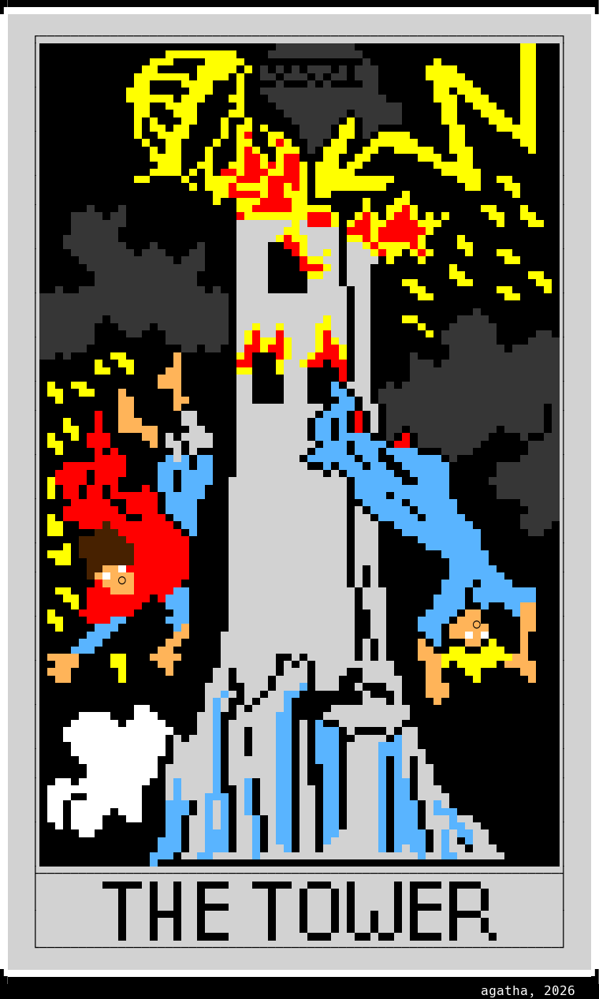

# ascii art
_repository of art created by agatha_

greetz to jewbird for creating [asciibird](https://github.com/birdneststream/asciibird), one of
the only ascii editors that supports 99-color mirc format.

**pumping with weechat**:
```
/alias pump /exec -o -sh while IFS= read -r l\; do printf "%s\n" "$l"\; sleep 0.3\; done < $1
```


